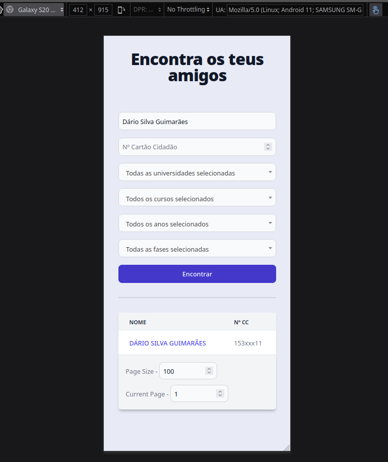

<!-- PROJECT LOGO -->
<br />
<div align="center">
  <h3 align="center">FindYourFriendUniversity</h3>

  <p align="center">
    A database of every Portuguese student who's ever attended university.
    <br />
    <br />
    <a href="#-demo">View Demo</a>
    &middot;
    <a href="#-getting-started-with-development">Start Developing</a>
  </p>

<h4 align="center">
⭐ Don't forget to Starring ⭐
</h4>

  <div align="center">

[![Python][Python-badge]][Python-url]
[![Elixir][Elixir-badge]][Elixir-url]
[![Phoenix][Phoenix-badge]][Phoenix-url]
[![PostgreSQL][PostgreSQL-badge]][PostgreSQL-url]

  </div>

</div>


<!-- TABLE OF CONTENTS -->
<details>
  <summary>📋 Table of Contents</summary>

## 📋 Table of Contents

- [About The Project](#-about-the-project)
- [Getting Started with Development](#-getting-started-with-development)
- [Contributing](#-contributing)
- [Disclaimer](#️-disclaimer)
- [Developed by](#-developed-by)
</details>


## 🔍 About The Project

### 🎯 The goal

FindYourFriendUniversity started as POC to scrape and navigate over the data on DGES website. After the success I decided to create an Elixir Phoenix App, that alongside the initial Python script, indexes all the candidatures and collocations of all the students that were already candidates to Portuguese Public Universities.


### ⚙️ How it works?

Basically a Python script scrapes the data from DGES and saves it on a JSON file. Then a Phoenix App reads the JSON file and populates the database with the data and starts a webserver where you can search for students, courses, universities and applications.

#### Walkthrough 🗺️

This was my first "big" Phoenix project, so I decided let a [walkthrough](./WALKTHROUGH.md) about what I did.


### 🎬 Demo

Here you can see a demo over the real data from DGES (only showing me), and then the complete Website Frontend with fake data. You can also see a screenshot of the website responsiveness on mobile phones.

https://github.com/Darguima/FindYourFriendUniversity/assets/49988070/96e2d543-7a87-420c-812d-2a01a697c27f




## 🚀 Getting Started with Development

Below, you have the instructions to run the project in development and deployment mode. Choose the one that fits you better.

### 1. Prerequisites

Start by installing the following tools:

- [Git](https://git-scm.com/downloads) - Version Control System
- [Python](https://www.python.org/downloads/) - Programming Language
- [Docker](https://www.docker.com/products/docker-desktop) - Containerization Platform
- [asdf](https://asdf-vm.com/guide/getting-started.html) - Version Manager (optional, but recommended)
- [Elixir](https://elixir-lang.org/install.html) - Functional Programming Language (install with asdf)

### 2. Cloning

Now clone the repository to your local machine. You can do this using Git:

```bash
$ git clone git@github.com:darguima/FindYourFriendUniversity.git
# or
$ git clone https://github.com/darguima/FindYourFriendUniversity.git
```

### 3. Preparing the Seeds

Let's start by getting the seeds to populate the database. You have two options, generate fake data or scrape the real data from DGES.

For both options you have python scripts to do that and both will output at `./seeds/` folder.

All the files that are present at `./seeds/` folder and respect the naming pattern will be used, so remember to maintain this folder clean. Applications files should be named like `applications_*.json`.

If you are thinking about scraping the data take in mind that this is the slowest option to setup, you will need install the `beautifulsoup4` package and scrape real data can go against the GDPR.

To generate fake data:

```bash
$ python faker_seeds.py
```

To scrape the official data from DGES:

```bash
# Preparing the environment
$ python -m venv .venv # Just run once
$ source .venv/bin/activate # Run on new each terminal session
$ pip install -r requirements.txt # Just run once

# Scraping the data
$ python applications_scraper.py
```

### 4.1 Development Server

Start by installing [`asdf`](https://asdf-vm.com/guide/getting-started.html). Now you can install Elixir and Erlang:

```bash
$ asdf install
```

Then you need create the Database. I like to use Docker for that:

```bash
$ docker run --name fyfu_db -e POSTGRES_PASSWORD=postgres -p 5432:5432 -d postgres

# Start the container at computer startup
$ docker run --restart=always --name fyfu_db -e POSTGRES_PASSWORD=postgres -p 5432:5432 -d postgres
```

Now you can run the setup script and start the Phoenix server:

```bash
$ mix setup
$ mix phx.server
```

And the server will be running at [`localhost:4000`](http://localhost:4000).

### 4.2 Deployment Server

To deploy the server I prepared a Docker Container to easily deploy it anywhere. Edit the `./docker/.env` file with your environment variables and run the following commands:

```bash
docker compose -f docker/docker-compose.yml up --build
```

Now you can access the server at the localhost on the port you defined in the `.env` file.

Then you need to populate the database.

```bash
# Clean the seeds folder (just if you want to remove the previously added seeds)
docker exec -it fyfu_app rm /app/seeds/ -rf

# Copy seeds available now at seeds folder
docker cp ./seeds/ fyfu_app:/app/seeds/

# Run the seeds
docker exec -it fyfu_app mix ecto.setup
```

To completely remove the container and the volumes, run:

```bash
docker compose -f docker/docker-compose.yml down -v
```


## 🤝 Contributing

Contributions are what make the open source community such an amazing place to learn, inspire, and create. Any contributions you make are **greatly appreciated**.

If you have a suggestion that would make this better, please fork the repo and create a pull request. You can also simply open an issue with the tag "enhancement".
Don't forget to give the project a star! Thanks again!

1. Fork the Project
2. Create your Feature Branch (`git checkout -b feature/AmazingFeature`)
3. Commit your Changes (`git commit -m 'Add some AmazingFeature'`)
4. Push to the Branch (`git push origin feature/AmazingFeature`)
5. Open a Pull Request


## ⚠️ Disclaimer

With this Python script you will be able to scrape real personal data from DGES website. Although this is illegal due GDPR in Europe. Be careful when dealing with others personal information online. This was just a study case.


## 👨‍💻 Developed by

- [Darguima](https://github.com/darguima)


<!-- MARKDOWN LINKS & IMAGES -->
<!-- https://www.markdownguide.org/basic-syntax/#reference-style-links -->
[Python-badge]: https://img.shields.io/badge/Python-3776AB?style=for-the-badge&logo=python&logoColor=white  
[Python-url]: https://www.python.org/

[Elixir-badge]: https://img.shields.io/badge/Elixir-4B275F?style=for-the-badge&logo=elixir&logoColor=white  
[Elixir-url]: https://elixir-lang.org/

[Phoenix-badge]: https://img.shields.io/badge/Phoenix%20Framework-F05423?style=for-the-badge&logo=phoenix-framework&logoColor=white  
[Phoenix-url]: https://www.phoenixframework.org/

[PostgreSQL-badge]: https://img.shields.io/badge/PostgreSQL-4169E1?style=for-the-badge&logo=postgresql&logoColor=white  
[PostgreSQL-url]: https://www.postgresql.org/

